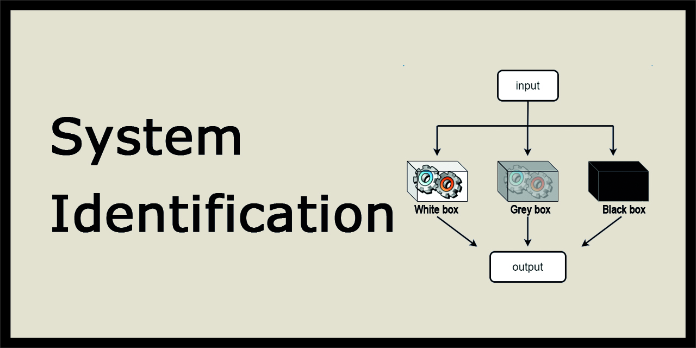

# 🔬 System Identification Repository 📊

Welcome to the System Identification Repository! This GitHub repository is dedicated to hosting assignments and course materials for the System Identification course at K.N. Toosi University of Technology.

## Course Overview 📚

System Identification is a fascinating discipline that plays a crucial role in engineering and data analysis. It focuses on constructing mathematical models to understand and predict the behavior of complex systems. Throughout this course, we will delve into various topics, including time-domain and frequency-domain identification methods, parametric and non-parametric modeling, and model validation. Our esteemed instructor, Professor Hamid Khaloozadeh, from the Department of Systems and Control, K.N. Toosi University of Technology, will guide us through this intriguing journey.

## Collaboration 👥

Collaboration fosters a dynamic and enriching learning environment. Feel free to share your suggestions, report any issues with the content, or contribute to the repository by creating issues or pull requests. Together, we can enhance the overall learning experience for everyone.

Let's embark on this exciting voyage of system identification, where knowledge and creativity converge. 🚀

## Contact Information 📞

For any queries or assistance regarding the course materials or repository, don't hesitate to reach out to our friendly teaching assistant:

**Moein Sarbandi**  
Teaching Assistant - System Identification Course  
Email: moeinsarbandi15@gmail.com 📧

## References 📚
- T. Soderstrom, P. Stoica, System Identification, Prentice Hall, 1989.
- J. P. Norton, An Introduction to Identification, Academic Press, New York, 1986.
- L. Ljung, System Identification, Prentice Hall, 1987.

We are thrilled to have you on board and look forward to witnessing your growth in mastering system identification techniques. Happy learning! 🌟
